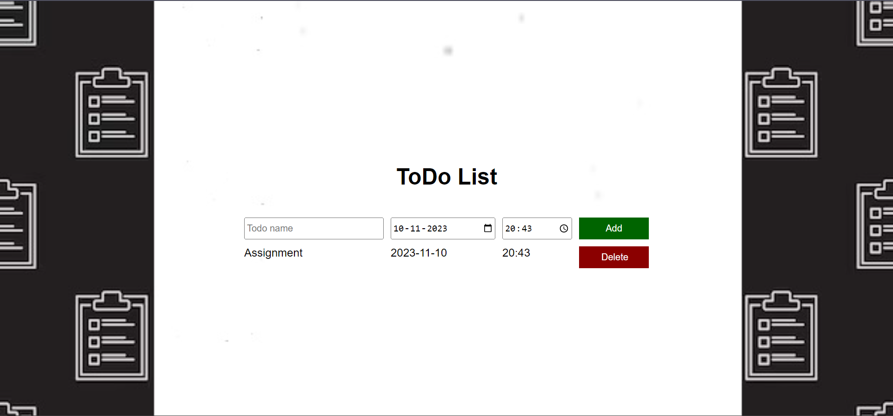
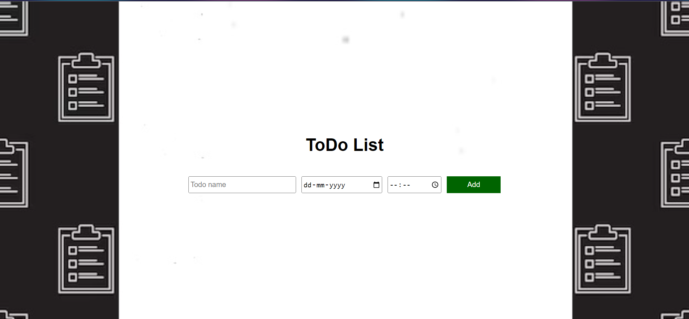

<h1>TO-DO LIST</h1>
<ol>
<li>Organization: Helps you keep track of tasks and prioritize them.</li>
<li>Productivity Boost: Guides your focus, preventing overwhelm and procrastination.</li>
<li>Memory Aid: Frees up mental space by externalizing what needs attention.</li>
<li>Goal Alignment: Ensures daily actions align with broader goals and objectives.</li>
<li>Sense of Achievement: Checking off items provides a sense of accomplishment and motivation.</li>
</ol>

This project lets you save your tasks with date and time.There is an option to delete as you accomplish each task.

  <table>
    <tr>  </tr>
    
  </table>

